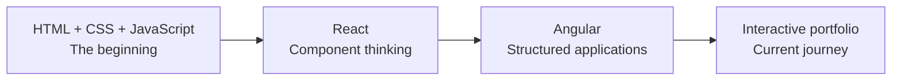

# Satish Pakalapati — The Portfolio Journey

> Every version of this portfolio represents a stage in my journey—from writing my first HTML page to building an interactive Angular experience.

🌐 **Explore the portfolio:** [www.satishpakalapati.in](https://www.satishpakalapati.in)

## The story behind this repository

This is not just a portfolio website. It is a visual record of how I learned, experimented, and evolved as a developer.

The project began with simple pages built using **HTML, CSS, and JavaScript**. As my skills grew, the portfolio changed with me: first becoming a **React** application, then evolving into the current **Angular** experience with interactive visuals, responsive layouts, and animated sections.



## Chapter 1 — HTML, CSS, and JavaScript

The journey started with the fundamentals:

- Structuring pages with semantic HTML
- Designing layouts with CSS
- Adding interaction with JavaScript
- Learning how a website comes alive in the browser

This stage created the foundation for everything that followed.

## Chapter 2 — React

The portfolio then moved into React, where the focus shifted from individual pages to reusable components and a more dynamic user experience.

This chapter introduced:

- Component-based UI development
- Reusable sections and layouts
- State-driven interactions
- A more maintainable approach to building the portfolio

The `reactversion` branch preserves this stage of the journey.

## Chapter 3 — Angular

The current `main` branch is an Angular 21 portfolio application written in TypeScript.

Angular provides the structure for the latest version of the site, while CSS, Three.js, and Remix Icon help create the visual and interactive experience.

The current version includes:

- Responsive portfolio sections
- Animated transitions and visual storytelling
- Interactive and 3D-inspired elements with Three.js
- Project, skills, experience, and contact information
- Downloadable public assets, including the resume
- Production builds configured for deployment

## A portfolio designed as a story

The goal is for the website to feel like a journey rather than a collection of disconnected sections.

As visitors scroll, each section should reveal another part of the story:

1. **Introduction** — who I am and what I build
2. **Skills** — the tools and technologies I use
3. **Projects** — the problems I have explored and solved
4. **Experience** — how my knowledge has developed
5. **Resume and contact** — where the journey can continue

Animations are used to guide attention, create movement, and make the experience feel alive while keeping the content readable and accessible.

## Technology timeline

| Stage | Main technologies | What it represents |
| --- | --- | --- |
| Foundation | HTML, CSS, JavaScript | Learning how the web works |
| Component era | React | Building reusable and interactive interfaces |
| Application era | Angular, TypeScript | Creating a structured portfolio application |
| Visual experience | CSS, Three.js, Remix Icon | Turning the portfolio into an interactive story |

## Current project structure

- `src/app/` — Angular components and application features
- `src/assets/` — source assets used by the application
- `src/index.css` — global styles and responsive design rules
- `src/logo_styles.css` — logo styling
- `public/` — static files served with the application
- `angular.json` — Angular workspace and build configuration
- `package.json` — scripts and dependencies
- `netlify.toml` — deployment configuration

## Run the portfolio locally

### Requirements

- Node.js
- npm

### Install dependencies

```bash
npm install
```

### Start the development server

```bash
npm run dev
```

Open the local URL displayed by Angular CLI, usually `http://localhost:4200/`.

### Build for production

```bash
npm run build
```

The production output is generated in `dist/`.

## Branches: the archived chapters

Each branch represents a different experiment, version, or chapter in the portfolio's history.

| Branch | Chapter or purpose |
| --- | --- |
| `main` | Current Angular portfolio and the primary maintained version. |
| `SPA_Version` | Single-page application version of the portfolio. |
| `backupforfirstangularproject` | Backup of the first Angular portfolio project. |
| `base` | Early base version of the project. |
| `copilot/update-portfolio-url-in-resume` | Branch created to update the portfolio URL in the resume PDF. |
| `gameversion` | Experimental version with game-oriented features. |
| `portfolio_v1` | Earlier portfolio version. |
| `reactversion` | React chapter of the portfolio journey. |
| `satishlab` | Experimental development branch. |
| `snakefillv1` | Experimental version containing a Snake game feature. |

The branches are preserved as a timeline of ideas—not every branch is intended to be production-ready.

## Links

- **Portfolio:** [www.satishpakalapati.in](https://www.satishpakalapati.in)
- **GitHub:** [Satish-970](https://github.com/Satish-970)
- **LinkedIn:** [Satish Pakalapati](https://www.linkedin.com/in/satishpakalapati/)

## Keep following the journey

The portfolio will continue to change as I learn new technologies, explore better ways to tell stories on the web, and build experiences that combine engineering with design.

> The first page was built with HTML, CSS, and JavaScript. The journey continues with React, Angular, animation, and everything still left to learn.
